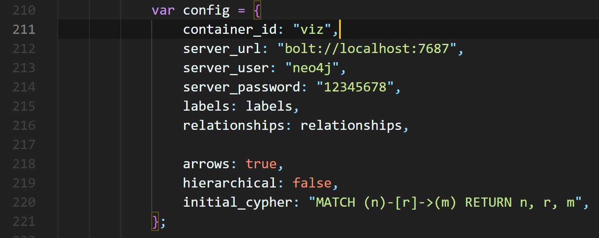
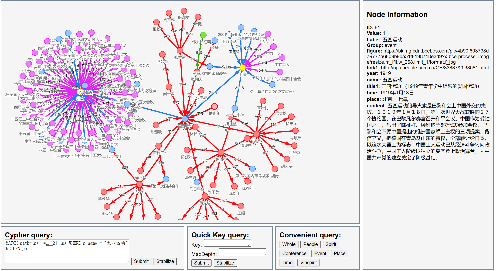
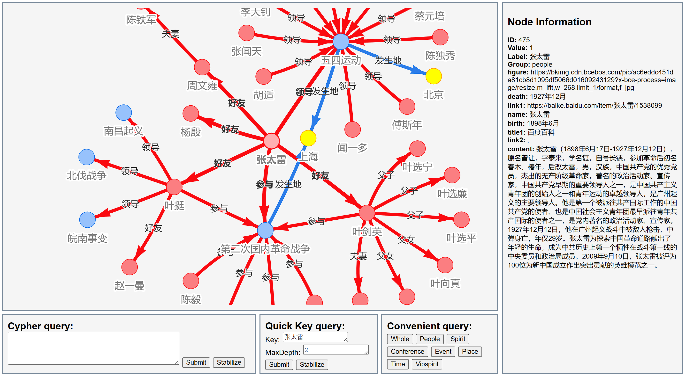
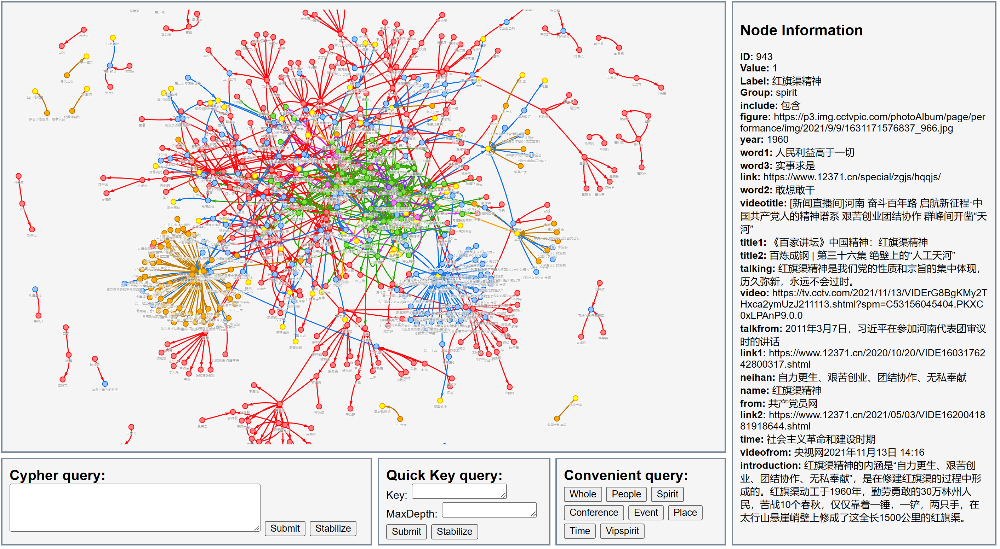
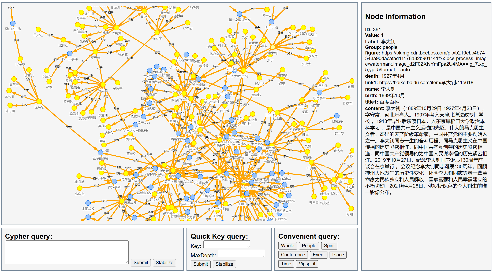

# *Party History Knowledge Graph* (Based on Neo4j and Neovis.js)

## 项目架构

- picture文件夹下是示例图片。
- html文件夹为html源代码
- static文件夹内含有neovis.js

## 使用教程

1. 终端键入"neo4j console"，打开neo4j

2. 将党史数据读入到neo4j中 

3. 修改"html/display.html"代码如下关于neo4j的配置部分

4. 使用浏览器打开display.html

## 创新点

提出Cypher query, Quick Key query, Convenient query三种适用于知识图谱的快捷查询方式, 使得知识图谱更好理解

## 功能介绍

页面包含五个分区，分别是：
- 可视化的党史知识图谱
- Cypher语句输入查询(Cypher query)
- 节点信息显示(Node Information)，鼠标点击节点可显示详细信息
- 快速键值查询(Quick Key query)
  - 提供Key值输入，以Key值为中心查找关系
  - 提供MaxDepth输入，限制图的深度
- 快捷关系查询(Convenient query)
  - 提供8个值快捷查询
  - 8个值的含义：
    - Whole表示全部显示
    - People表示人物关系
    - Spirit表示精神谱系
    - Conference表示党的会议关系
    - Event表示事件关系
    - Place表示地点关系
    - Time表示时期关系
    - Vipspirit表示伟大建党精神的关系

## 示例效果

- **Cypher query**

- **Quick Key query**

以“张太雷”为Key值，2为MaxDepth值

- **Convenient query**

Whole 

People 

